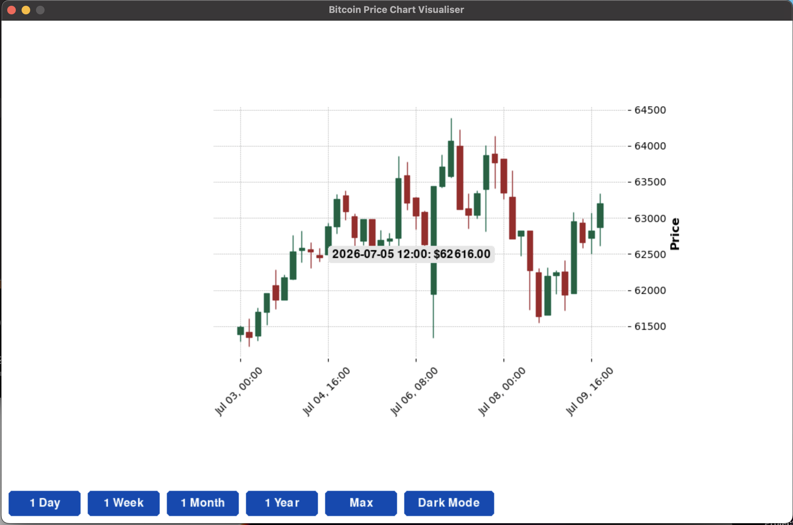
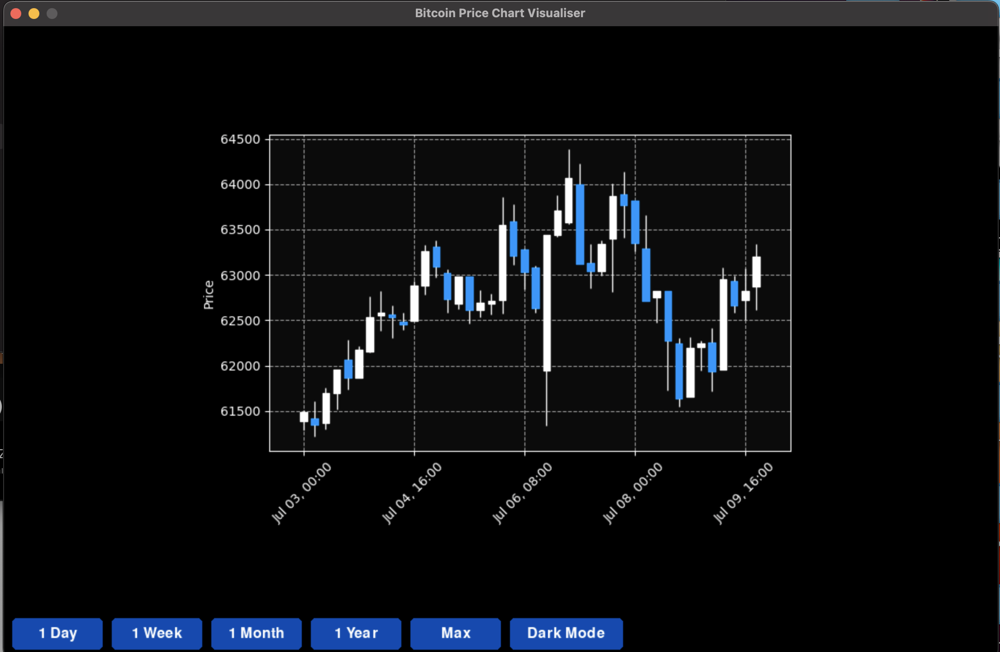

# Bitcoin Price Chart Visualiser

A Python desktop application that fetches Bitcoin OHLC market data from the CoinGecko API and displays interactive Bitcoin price charts using Pandas, Pygame and mplfinance.

This project was originally developed as part of a group university project. I later extended and refined my own version by improving the structure, chart display, caching, error handling, user interaction and project documentation.

## Overview

The application allows users to view Bitcoin price movement across different timeframes through an interactive desktop interface. It uses live market data from the CoinGecko API, processes the data with Pandas, and renders financial charts using mplfinance and Matplotlib.

This project helped me strengthen my practical experience with API integration, time-series financial data, data visualisation, caching, debugging and user-facing Python application development.

## Features

- Fetches Bitcoin OHLC market data from the CoinGecko API
- Displays candlestick charts for selected timeframes
- Supports multiple timeframes:
  - 1 Day
  - 1 Week
  - 1 Month
  - 1 Year
  - Max / All Time
- Uses Pandas to structure and process time-series market data
- Uses mplfinance and Matplotlib to generate financial charts
- Uses Pygame to create an interactive desktop interface
- Includes light mode and dark mode
- Shows a price tooltip based on mouse position
- Uses local caching to reduce repeated API calls
- Includes a refresh shortcut to reload the current data
- Includes basic error handling for failed API requests or missing data

## Technologies Used

- Python
- Pandas
- Requests
- mplfinance
- Matplotlib
- Pygame
- CoinGecko API
- Git and GitHub

## How to Run

### 1. Clone the repository

```bash
git clone https://github.com/LombeC10-coder/bitcoin-price-chart-visualiser.git
cd bitcoin-price-chart-visualiser
```

### 2. Create a virtual environment

```bash
python3 -m venv venv
```

### 3. Activate the virtual environment

#### On macOS/Linux

```bash
source venv/bin/activate
```

#### On Windows

```bash
venv\Scripts\activate
```

### 4. Install dependencies

```bash
pip install -r requirements.txt
```

### 5. Run the application

```bash
python main.py
```

## Project Structure

```text
bitcoin-price-chart-visualiser/
│
├── main.py
├── requirements.txt
├── README.md
├── .gitignore
├── screenshots/
│   ├── main-chart.png
│   ├── dark-mode.png
│   └── timeframe-view.png
├── cache/
│   └── .gitkeep
└── exports/
    └── .gitkeep
```

## Screenshots

### Main Chart View



### Dark Mode



### Timeframe Controls


